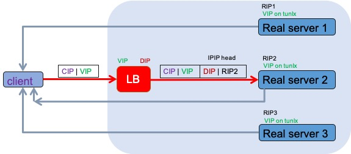
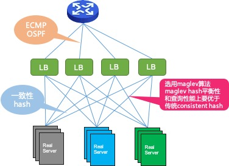
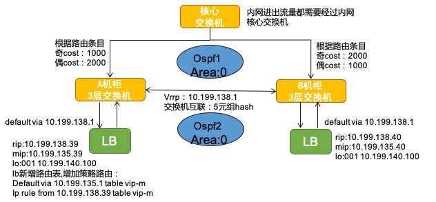
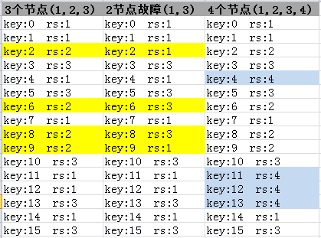
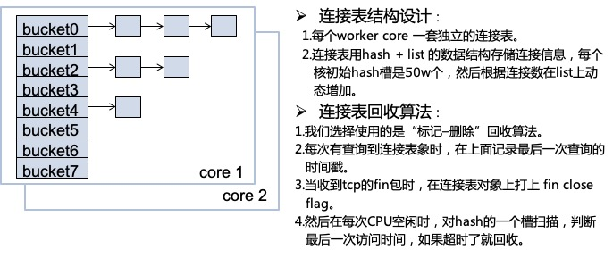
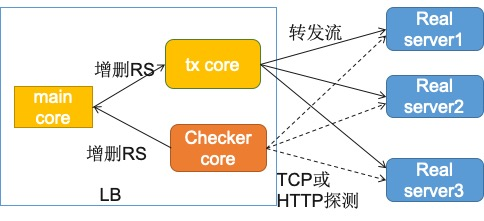
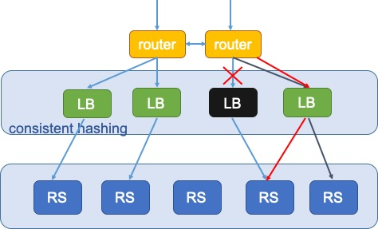

# 负载均衡&高可用 
  首先介绍一下4层负载均衡的转发原理，客户端的流量首先会到达负载均衡服务器上，由负载均衡服务器通过一定的调度算法将流量分发到不同的应用服务器上面；功能上类似最流行的开源软件（LVS）  
  名词解释：
>RS : real server, 提供真正服务的服务器 
>CIP : 客户端IP  
>VIP : LB的虚拟IP(对外服务IP) 
>RIP : 后端真正提供服务的服务器IP 

 
 
  TUN模式不要求 LB与real server在同一子网内， LB通过转发算法选择real server。在转发前，LB会在IP层增加IPIP header，real server 在tunl口上都配置有相同的VIP,所以 real server能够正确收到，并且由内核驱动去掉IPIP header，再传给上层的应用程序；应用程序看到的包就像直接在客户端发过来的一样，所以回复的时候就直接回复给客户端。  

# LB的部署架构  
   LB集群使用OSPF登记路由来实现高可用，  
   LB使用 maglev hash(一致性算法)来选择real server，选择的key是源目ip port和协议号，所以同一个流就算走的不同LB，转发到的real server也是同一个。  
   
 
 这样的部署架构具有灵活的扩容能力，当转发的流量增加时，可以通过简单的增加LB负载均衡机器，来实现方便的扩容；也提供了灵活的故障转能力；LB的容灾能力主要从三个方面介绍：
 - LB的入口交换机的高可用部署；
 - LB自身的一致性hash转发和连接会话表；
 - LB主动对后端REAL SERVER健康探测；
 
## LB+OSPF组网  
 
 一个LB集群会部署在一个机房的两个机柜中，机柜的交换机直连入口交换机；根据奇偶IP路由到不同交换机上，并且机柜交换机之间形成一个OSPF域。  
 一个LB集群在每个机柜会部署两台LB服务器，两个机柜的4台LB服务器会组成一个OSPF域。当任一节点或链路故障时，网络依靠OSPF进行故障收敛，自动切换流量到其它可用的节点上。

## 一致性HASH
Google在它的一篇关于负载均衡的论文（Maglev: A Fast and Reliable Software Network Load Balancer）中提到了它们用的一种一致性hash算法，然后我们参考他的论文实现了这个算法。  
由于论文上原始算法是对后端real server均匀负载的，但我们希望VGW还要有流量调度功能，即根据配置不同的weight值来调度每台real server不同的流量；然后我们对算法做了一些修改。  
评价一致性hash的好坏，主要关注以下两点：  
-	平衡性(Balance)：  
平衡性是指哈希的结果能够尽可能均衡的分布到所有的节点中去，很多哈希算法都能够满足这一条件。
-	单调性(Monotonicity)：  
单调性是指如果已经有一些流量通过哈希分派到了相应的节点，又有新的节点加入到系统中。哈希的结果应能够保证原有已分配的内容可以被映射到原有的或者新的节点中去，而不会被映射到旧的集合中的其他节点。

  

上图是有节点变化时，VGW maglev hash 的单调性转发，上图模拟了两种场景（原有三个转发的节点）:
-  有单点故障时（2节点故障）  
  可以看到原来转发到 1、3节点的流量仍然转发到1、3节点；  
  原来转发到2节点的流量被均匀分布到另外两个节点上；
- 增加一个节点时（4节点）  
  原来转发到1、2、3节点的流量有一部分转发到新的节点4上去；  
  其它的流量继续转到原来的节点； 
  
Maglev Hash与Consistent Hashing 的对比：  
- 平衡性(Balance)  
  maglev hash通过轮询放入loopup table（entry）数组，保证每个节点的机会是均衡的。consistent hash 通过增加虚拟节点的倍数来保证平衡性，虚拟节点的倍数越高平衡性越好。缺点就是consistent hash 的loopup table 一般是一个树形结构（rbtree），虚拟节点越多查询时性能越差。
- 单调性(Monotonicity)  
  consistent hash通过有序的hash环，保证单点故障和增加节点时很好的单调性；  
  maglev hash通过之前生成的偏好表（permutation list）决定变化时的单调性。  
  缺点是maglev hash有些时候会出现disruption ，这一点上不如consistent hash。  
  
结论： 
maglev hash在平衡性和查询性能上要优于consistent hash；  
consistent hash在单调性上要优于maglev hash；  
在后端real server比较多的情况下，maglev hash 在性能和平衡性上会更好，所以我们目前选择使用maglev hash。  

## 连接表管理 
   
 在一定时间内将来自于同一个客户端的所有请求包定向至同一个real server；在指定时长内不再根据调度算法进行调度；保证一次TCP会话都转发到同一台real server上。  
 LB内部维护一个连接表，当有TCP包进入到LB后，首先会根据5元组（源IP、目标IP、源端口、目标端口、协议类型）查询连接表，如果已经有匹配的连接表，就继续按照连接表上指定的real server转发；否则就通过一致性hash 选择一个real server转发。

## 对后端REAL SERVER健康探测  
  
LB 和LVS的keepalived 实现原理一样，可以实现两种健康检查。
- tcp connect连接探测，如果连接成功就认为服务可用。
- http get探测，可以在real server服务器上设置health check url 返回一个固定值（200），LB在执行http get检查返回值正确，就认为服务可用。

对LVS管理软件keepalived进行了一些优化：
- 优化了网络异步模型，select改为epoll方式；
  原来的keepalived程序是用的select模型，当探测的连接数比较多时，select模型就不合适了，我们的VGW改用的epoll模型，在测试环境我们可以做到对10000个real server端口做健康探测。
- 将健康检查逻辑和LB程序集成，由一个单独线程完成健康检查任务；
健康检查线程和LB主线程通过队列实时传递消息，保证了LB可以及时响应健康检查结果。

# 对比LVS在容灾上的优势
一般LVS会选择主备部署模式，这种部署架构在性能上无法拓展；一个VIP下的流量特别大时无法灵活拓展，只能额外再部署一个VIP到新的LVS上，然后通过DNS分流。  
在部署模式方面LVS也可以使用LB这种ECMP集群的部署架构，但是现有的开源LVS方案还存在下面一些不足：    
1. LB的的高性能，保证了在故障转移时，不容易出现短时间的瓶颈。
   当发生故障转移时，到故障机器的流量会被转移到其它LVS上，对其它的LVS会产生大量的新建连接（CPS），而LVS的新建连接每秒只有20万/秒，LB可以达到180万/秒。
2. LVS没有一致性HASH作为转发算法，当发生单点LVS故障后，这台LVS上的已有连接需要重新建立TCP连接；
   而LB由于使用了一致性HASH的调度算法，单点LB故障后，调度到其它LB的流量，根据一致性hash算法，仍然会转发到同一台real server上；对于client 和 real server 根本感知不到中间发生的故障转移。
  

